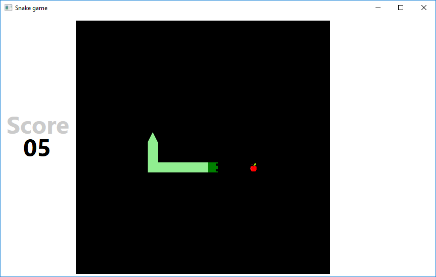

# SnakeGame

 
## Simple snake game created using C# and WPF

Control snake using keyboard `up`, `down`, `left`, `right` keys. World size is 25x25, game loop set to 5 frames per second. Game has no wall collision.

## UI screenshot

